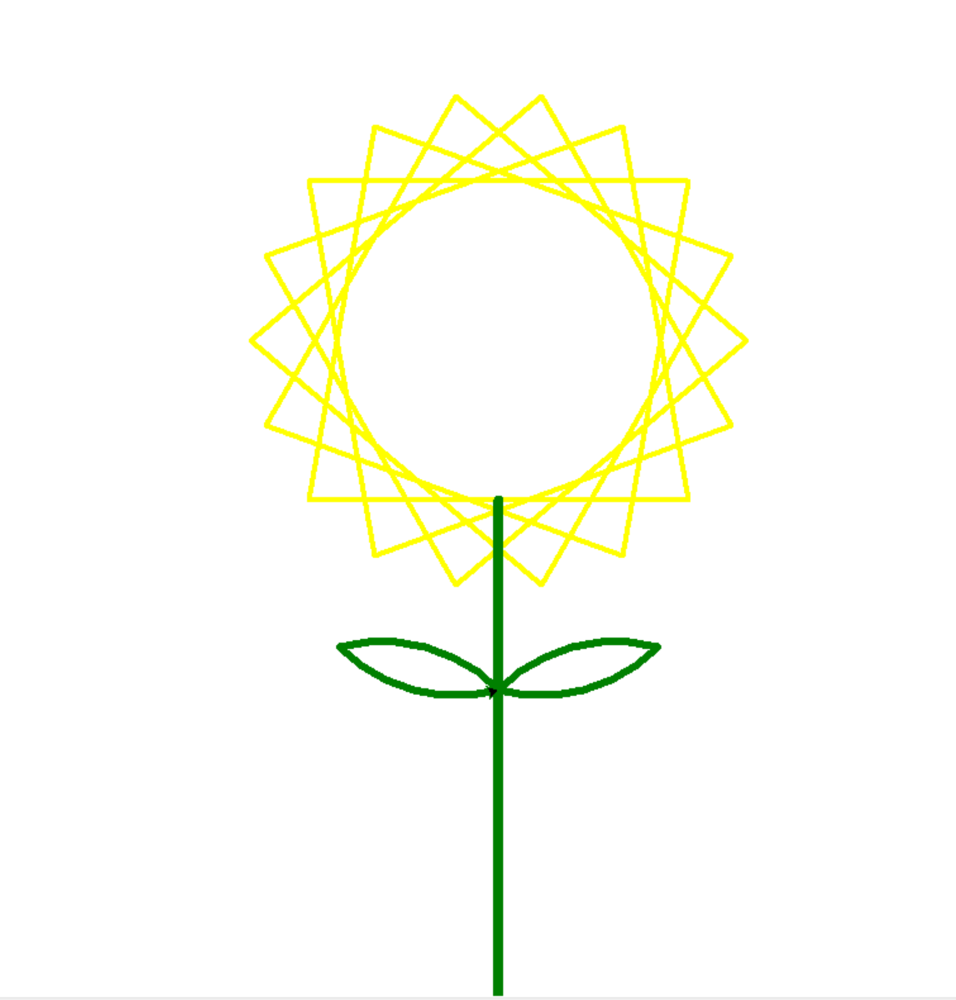

# 爱心代码

## 仓库介绍

此项目旨在收集和分享各种与爱心主题相关的代码示例，包括前端（HTML、CSS、JavaScript）、Python等语言。通过这些代码示例，希望能帮助开发者更好地表达和传递爱心与情感。

## 1.资源一（001/文件夹）
| 代码路径                                                                                                   | 代码类型   | 预览图                              | 演示                                                                     |
|--------------------------------------------------------------------------------------------------------|--------|----------------------------------|------------------------------------------------------------------------|
| [001/html_love/01](https://github.com/Whale-Yu/loveCode/tree/master/001/html_love/01)                  | HTML   |  | [demo](https://whale-yu.github.io/loveCode/001/html_love/01/index.html) |
| [001/html_love/02](https://github.com/Whale-Yu/loveCode/tree/master/001/html_love/02)                  | HTML |  | [demo](https://whale-yu.github.io/loveCode/001/html_love/02/index.htm) |
| [001/html_love/03](https://github.com/Whale-Yu/loveCode/tree/master/001/html_love/03)                  | HTML   |  | [demo](https://whale-yu.github.io/loveCode/001/html_love/03/index.html) |
| [001/html_love/04](https://github.com/Whale-Yu/loveCode/tree/master/001/html_love/04)                  | HTML   |  | [demo](https://whale-yu.github.io/loveCode/001/html_love/04/index.html) |
| [001/html_love/05](https://github.com/Whale-Yu/loveCode/tree/master/001/html_love/05)                  | HTML   |  | /                                                                      |
| [001/html_love/06](https://github.com/Whale-Yu/loveCode/tree/master/001/html_love/06)                  | HTML   |  | [demo](https://whale-yu.github.io/loveCode/001/html_love/06/index.htm) |
| [001/html_love/07](https://github.com/Whale-Yu/loveCode/tree/master/001/html_love/07)                  | HTML   |  | [demo](https://whale-yu.github.io/loveCode/001/html_love/07/index.html) |
| [001/html_love/08](https://github.com/Whale-Yu/loveCode/tree/master/001/html_love/08)                  | HTML   |  | [demo](https://whale-yu.github.io/loveCode/001/html_love/08/index.html) |
| [001/html_love/09](https://github.com/Whale-Yu/loveCode/tree/master/001/html_love/09)                  | HTML   |  | /                                                                      |
| [001/html_love/10](https://github.com/Whale-Yu/loveCode/tree/master/001/html_love/10)                  | HTML   |  | [demo](https://whale-yu.github.io/loveCode/001/html_love/10/index.html) |
| [001/py_love/跳动的爱心1.py](https://github.com/Whale-Yu/loveCode/tree/master/001/py_love/跳动的爱心1.py)        | Python |      | 下载代码本地运行即可                                                             |
| [001/py_love/跳动的爱心-文字版.py](https://github.com/Whale-Yu/loveCode/tree/master/001/py_love/跳动的爱心2-文字版.py) | Python |     | 下载代码本地运行即可                                                             |
| [001/py_love/一箭穿心.py](https://github.com/Whale-Yu/loveCode/tree/master/001/py_love/一箭穿心.py)               | Python |      | 下载代码本地运行即可                                                             |
| [001/py_love/向日葵.py](https://github.com/Whale-Yu/loveCode/tree/master/001/py_love/向日葵.py)                | Python |       | 下载代码本地运行即可                                                             |
| [001/py_love/太阳花.py](https://github.com/Whale-Yu/loveCode/tree/master/001/py_love/太阳花.py)                | Python |       | 下载代码本地运行即可                                                             |
| [001/py_love/射心.py](https://github.com/Whale-Yu/loveCode/tree/master/001/py_love/射心.py)                 | Python |        | 下载代码本地运行即可                                                             |
| [001/py_love/情人节表白.py](https://github.com/Whale-Yu/loveCode/tree/master/001/py_love/情人节表白.py)              | Python |     | 下载代码本地运行即可     |
| [001/py_love/情人节表白2.py](https://github.com/Whale-Yu/loveCode/tree/master/001/py_love/情人节表白2.py)             | Python |    | 下载代码本地运行即可                                                              |
| [001/py_love/送一朵玫瑰花.py](https://github.com/Whale-Yu/loveCode/tree/master/001/py_love/送一朵玫瑰花.py)             | Python |    | 下载代码本地运行即可                                                              |

## 2.资源二（002）
| 代码路径                                                        | 代码类型   | 预览图                                  | 演示                                                                     |
|-------------------------------------------------------------|--------|--------------------------------------|------------------------------------------------------------------------|
| [002](https://github.com/Whale-Yu/loveCode/tree/master/002) | HTML   |  | [demo](https://whale-yu.github.io/loveCode/002/index.html) |
[来源:-3D](https://github.com/Kaiser-DMr/-3D?tab=readme-ov-file)
## 技术支持

如果在运行python或部署前端代码有任何问题时

欢迎咨询：2944582448（q）

技术支持不无偿，带诚意来~